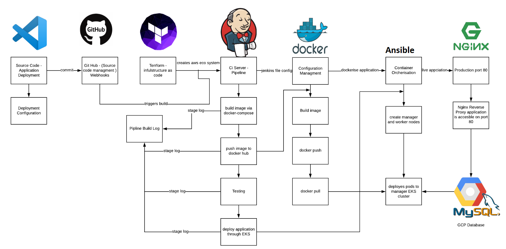

# Group-cloud-QA3

## Introduction
### Design specification:
Design and implement a solution for automating the development workflows and deployments of an unfamiliar application in a restricted timeframe. 
We were given a vet clinic web app with separate front and backend infrastructures. This application was written in a mix of Java and TypeScript.
The goal was to create a CI/CD pipeline, utilising the tools, systems and principals we had learned up until now.
For this to work, the group has utilised the following architecture: 
- IAAS - Terraform to create the AWS ecosystem and Configure the environment of the Virtual machines.
- EKS to orchestrate the containers which will run the applications.
- CI Server - Jenkins functioning as pipeline with Webhooks from the version control GIt Hub, to trigger builds.
Through this presentation we hope to demonstrate;
- A working knowledge of tools including terraform and kubernetes
- The ability to work effectively on the GCP plactform
- The use of Agile and DevOps principles
- The ability to work as a self-managed autonomous team
- An understanding of the importance and use of conventions

## Project Planning
We used a trello board to create a list of actions and instructions that must be executed in order for us to reach our objective. This was very beneficial as it helps us keep track of what we are doing and what we have left to do. Each person is able to access this board and place each work load in the sections they fit is right. When the designated person finishes the work they have been set, they are able to place it in the completed section. 

        

As part of our planning stage, a risk assessment was crutial to be carried out as we needed to know what potential hazards and incidents could occur as well as the impact it could leave. We have described a weide variety of scenarios that could occur along with the impact level, the likelyhood of this occuring and who would be responsible for the result which can all be seen below:

        

## Spreading the workload

Since this is a group project with a short time scale to complete it in, we decided to split the workload. We assigned each bit of work to the person who is most comfortable and also experienced in that  section. We  believed this was the best way to carry out our project as it would be the best time efficient out of the other options we had. We split up into two group where we each would focus on different aspects of the project. One group which is Ramtin and Ashley, would focus on containerising the front end and backend and getting it all up and running while the other pair, Saharsh and Kristaps, would focus on setting up jenkins and ansible, as well as a few other things. When one person is stuck in a difficult situation regarding their side of work, we would work and as a team and solve it together. We believe that, teamwork is very important in projects and we dedicate our time in making sure people are able to rely on their colleagues for assistance.

## Architecture- talk about the app, how everything connects

The diagram below displays the process our app goes throught in order to be able to deploy a functioning app. It had a desription of what technology we used as well as what we used it for and what each bit of the project connects to another. To give a brief description of the layout, it works as followed:
- Code is written on Visual Code studio. This could contain code for the app to function, testing or any files we need to make in order to be able to deploy.
- When code is written, it is then added to git, as well as commited and then pushed onto Github. Since we have connected a webhook to our Github, it will automatically trigger it and as a result, Jenkins will activate and do its thing.
- In Jenkins, when a hook is triggered, it runs our Jenkins file which contains testing, building and deployment to make sure they wont be any errors while deploying. When all sections are green, it means that the pipeline run was successful.
- After building the containers, they are then pushed to docker so it is able to be used. When docker receives it, it is then given to ansible where it is able to be orchestrated.
-Finally, it is run with nginx , so that the website is able to run.
 
 As you can see, we have terraform in our diagram, when we created the diagram, our initial idea was to implement terraform into our deployment but after a couple days of discussion, we believed our best course of action was to skip it out since we were closing in on the end of our time scale.

        

## CI Pipeline

For our pipeline, we have decided to use Jenkins as we believe it is the best option for us since we have experience with this pipeline and also so we can talk advantage of the Jenkins File. Having a jenkins file is very beneficial as it creates the steps it has to take for the pipeline to function. We have 3 stages that will be functioning in the pipeline. Our first stage will be Building, which will containerise different parts of our app and would build so it can be used later on. Our second stage is testing which will run tests on our app to ensure that everything is functional and there aren't any errors. The final stage is deployment which is possibly the most important step, which will implement our ansible scripts and will deploy our containers to the website.

picture of jenkins file

        

picture of jenkins pipeline

        

## Testing  

As mentioned previously, testing is implemented into our jenkins file which will operate everytime a change is created. Testing is crutial as it would check that everything was functional and that there arent any errors in the code. We had tests made from each section of the backend and testing would be considered successful when the jenkins pipeline has succesfully gone past it without any failures occuring.

picture of testing results

        

## Pricing

blah blah blah...

picture of costs below...

        

## Conclusion

In conclusion, it was a fun project which, also had its challenges along the way where we were able to discuss amongst ourselves and get past these obstacles. We were able to utlise our skills and knowledge on the sections we were each working on and was successfully able to complete our goal we set out to do. To be able to deploy the pet clinic app. Everyday, we had meetings where we discussed on what we are going to tackle and complete today. This would be done at the start of each morning as well as a afternoon checkup to see how each of us are doing. While the days went past, we took advantage of the trello board to see what steps we have completed and what we have left to do. In the end we were able to get everything working and the as a result, we had a amazing outcome and a satisfied client.

## Authors

Kristaps, Ashley, Ramtin, Saharsh